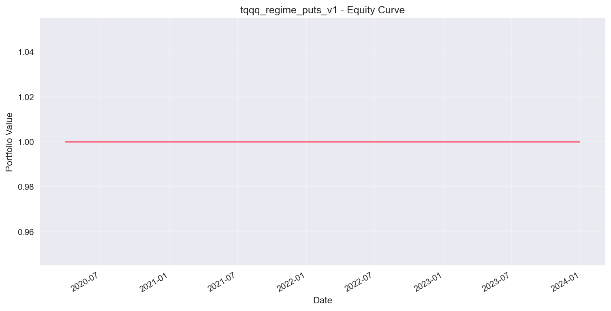
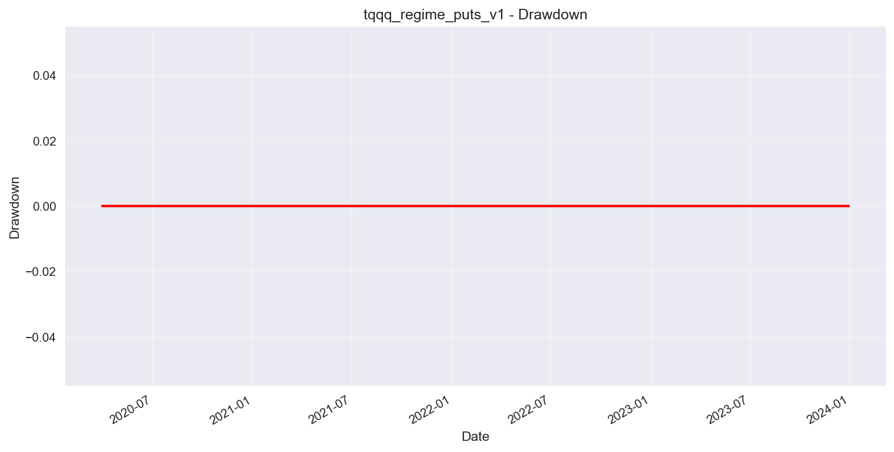
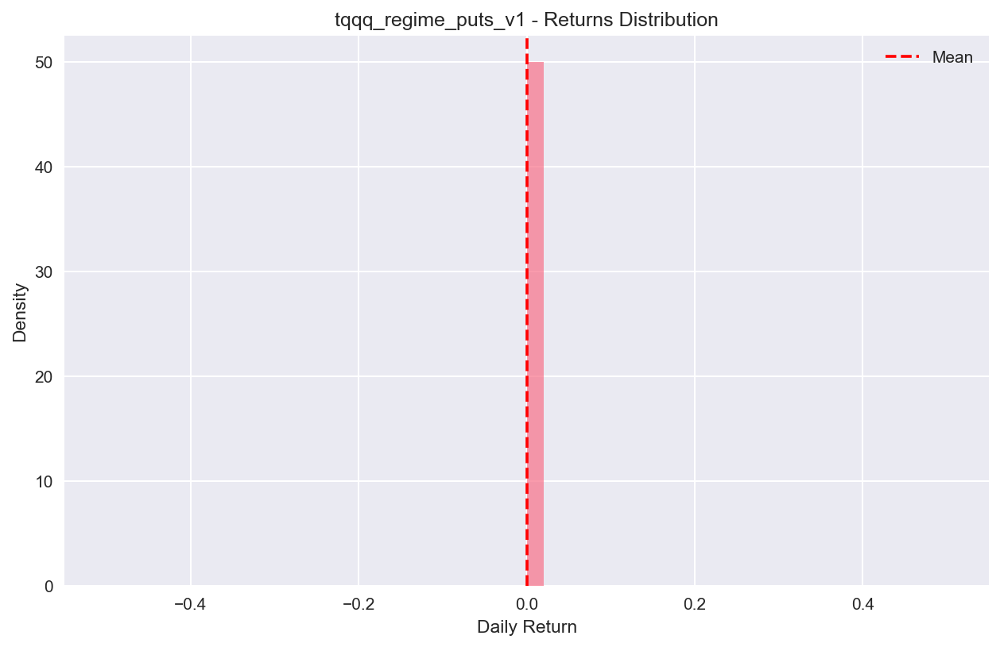

# Tqqq Regime Puts V1
**Strategy Research Note**

**Generated:** 2025-09-23 08:48:33

**Overview:** Long TQQQ with put protection during low IV regimes

## Strategy Metadata

- **Universe:** TQQQ
- **Signals:** 2
- **Entry Conditions:** 2 required
- **Options Overlays:** ['puts']
- **Risk Limits:** Max DD 25.0%


## Hypothesis & Strategy Logic

### Investment Hypothesis

1. Price trends persist: 20d MA crossing 200d MA signals sustained moves
2. Low implied volatility periods offer better risk-adjusted returns
3. Options overlays provide efficient risk management and enhance returns

### Entry Logic

Enter when ALL conditions are met:

- trend_filter.rule
- vol_regime<low_thresh

### Exit Logic

Exit when ANY condition is met:

- trend_filter.fast<trend_filter.slow


## Data & Methodology

### Data Sources

- **Universe:** TQQQ
- **Time Period:** 2020-01-02 00:00:00 to 2023-12-29 00:00:00
- **Frequency:** Daily
- **Source:** Yahoo Finance

### Backtesting Methodology

- **Execution:** Vectorized pandas/NumPy implementation
- **Costs:**
  - Commissions: 2.0 bps per trade
  - Slippage: 1.0 bps per trade
  - Options fees: $0.65 per contract
- **Position Sizing:**
  - Volatility targeting: 15.0% annualized
  - Max weight: 100.0% per position
- **Rebalancing:** Daily


## Performance Analysis

### Key Performance Metrics

| Metric | Value |
|--------|-------|
| Total Return | 0.00% |
| Annualized Return | 0.00% |
| Annualized Volatility | 0.00% |
| Sharpe Ratio | 0.00 |
| Max Drawdown | 0.00% |
| Win Rate | 0.0% |
| Profit Factor | inf |
| Calmar Ratio | 0.00 |

### Performance Commentary

**Poor risk-adjusted performance** with Sharpe ratio of 0.00. Drawdown of 0.0% is well within acceptable limits. Annualized returns of 0.0% are below expectations. 


## Risk Analysis

### Risk Metrics

| Risk Measure | Value | Assessment |
|--------------|-------|------------|
| Max Drawdown | 0.00% | ✅ Low |
| Annual Volatility | 0.00% | ✅ Low |
| 95% VaR | 0.00% | ✅ Low |

### Position & Sizing Risk

- **Average Exposure:** 0.0%
- **Maximum Exposure:** 0.0%
- **Portfolio Turnover:** 0.0x


## Robustness Testing

### Regime Analysis

| Market Regime | Sharpe | Return | Max DD |
|---------------|--------|--------|--------|

### Green Light Decision

**Status:** ❌ **REJECTED**

**Robustness Score:** 3/10 (low confidence)

**Approval Reasons:**
- Acceptable max drawdown: 0.00%
- Returns appear normally distributed

**Warnings/Concerns:**
- Low Sharpe ratio: 0.00
- Poor OOS performance


## Implementation Details

### Strategy DSL Specification

```json
{
  "name": "tqqq_regime_puts_v1",
  "universe": [
    "TQQQ"
  ],
  "description": "Long TQQQ with put protection during low IV regimes",
  "signals": [
    {
      "type": "MA_cross",
      "name": "trend_filter",
      "params": {
        "fast": 20,
        "slow": 200
      },
      "rule": "fast>slow"
    },
    {
      "type": "IV_proxy",
      "name": "vol_regime",
      "params": {
        "method": "rv20_scaled",
        "low_thresh": 0.45
      },
      "rule": null
    }
  ],
  "entry": {
    "all": [
      "trend_filter.rule",
      "vol_regime<low_thresh"
    ],
    "any": null,
    "none": null
  },
  "exit": {
    "all": null,
    "any": [
      "trend_filter.fast<trend_filter.slow"
    ],
    "time_based": null
  },
  "sizing": {
    "vol_target_ann": 0.15,
    "max_weight": 1.0,
    "min_weight": 0.0,
    "kelly_fraction": 0.5
  },
  "overlays": {
    "puts": {
      "target_delta": -0.2,
      "ratio": 0.5,
      "dte_min": 30,
      "dte_max": 90,
      "budget_pct_month": 0.01,
      "roll_trigger": {
        "min_delta_abs": 0.06,
        "min_dte": 25
      }
    }
  },
  "costs": {
    "commission_bps": 2.0,
    "fee_per_option": 0.65,
    "slippage_bps": 1.0,
    "borrow_rate_ann": 0.02
  },
  "risk": {
    "max_dd_pct": 0.25,
    "max_gross_exposure": 1.2,
    "max_sector_weight": 0.3,
    "max_single_position": 0.1,
    "circuit_breaker_dd": 0.05
  },
  "metadata": null
}
```

### Key Parameters

- **Vol Target:** 15.0% annualized
- **Max Position:** 100.0%
- **Max Drawdown:** 25.0%
- **Puts Overlay:** -0.20 Δ target


## Charts & Visualizations








## Next Steps & Recommendations

### ❌ Further Development Required

Strategy does not meet minimum robustness criteria.

**Recommended Actions:**
1. Review and strengthen entry/exit logic
2. Adjust position sizing parameters
3. Add additional risk management overlays
4. Re-test with different parameter combinations

### General Recommendations

1. **Data Quality:** Ensure data feeds are reliable and up-to-date
2. **Execution Quality:** Monitor slippage and transaction costs in live trading
3. **Risk Management:** Never exceed position limits or risk thresholds
4. **Performance Tracking:** Maintain detailed logs of all trades and decisions
5. **Regular Review:** Reassess strategy performance quarterly

---

*Report generated by AI Quant v1 on 2025-09-23 08:48:34*